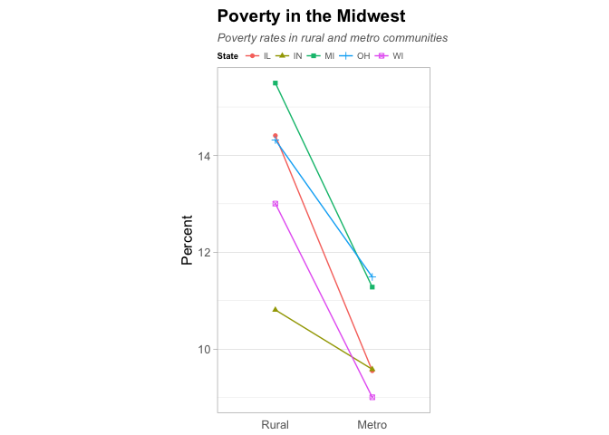
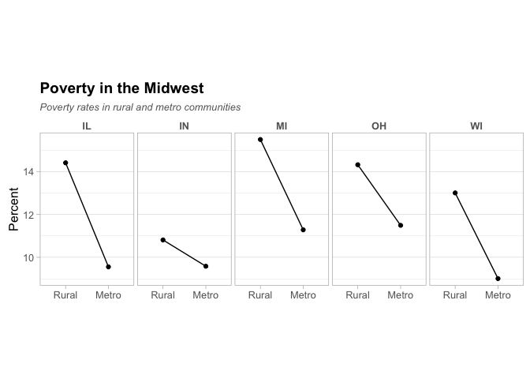
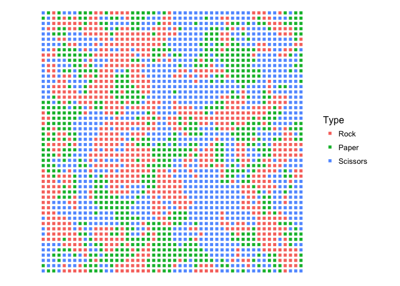
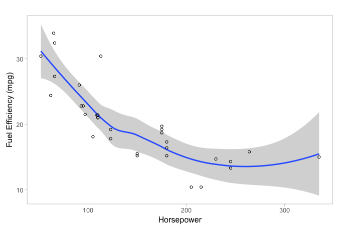
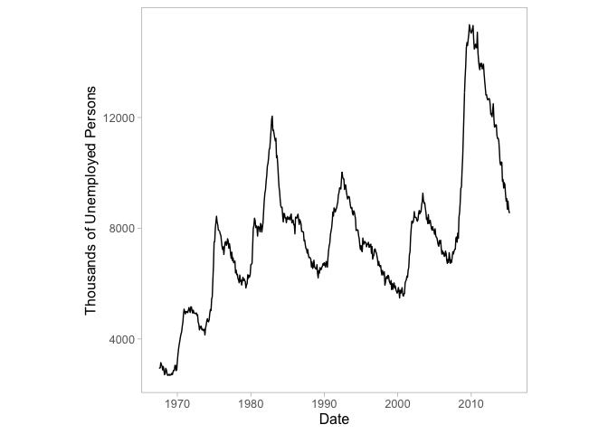

ggplot2bdc
==========

ggplot2bdc is a collection of themes and other things that can be used
when creating plots with [ggplot2](http://ggplot2.org/).

Installation
------------

`ggplot2bdc` is not on [CRAN](http://cran.r-project.org/), but you can
use
[devtools](http://cran.r-project.org/web/packages/devtools/index.html)
to install the latest and greatest version. To do so:

    if(!require("devtools")) install.packages("devtools")
    devtools::install_github("briandconnelly/ggplot2bdc")

Examples
--------

To gain access to the following themes, etc. provided, first load the
`gplot2bdc` package. We'll also load `ggplot`, `dplyr`, and `magrittr`
for these examples.

    library(ggplot2bdc)
    library(ggplot2)
    library(dplyr)
    library(magrittr)

### Themes

#### theme\_bdc\_grey

`theme_bdc_grey` is a clean theme that uses thin grey panels on a white
background. Legends are placed above. Facet labels are displayed as
black text on a grey background.

    pUnemploy <- ggplot(data = economics, aes(x = date, y = unemploy)) +
        geom_line() +
        scale_x_date() +
        labs(x = "Year", y = "Thousands of Persons",
             title = "Monthly Unemployment", subtitle = "Seasonally Adjusted",
             caption = "Source: Federal Reserve Bank of St. Louis") +
        theme_bdc_grey()
    pUnemploy

Subtle grid lines can be added to the panels with the `grid.x` and
`grid.y` parameters. These also affect minor grid lines, which can
further be controlled with the `gridmin.x` and `gridmin.y` parameters.

    midwest$inmetro <- factor(midwest$inmetro, levels = c(0, 1),
                              labels = c("Rural", "Metro"))

    ggplot(data = midwest,
           aes(x = inmetro, y = percbelowpoverty, color = state, shape = state)) +
        stat_summary(fun.y = "mean", geom = "line", aes(group = state)) +
        stat_summary(fun.y = "mean", geom = "point") +
        scale_color_hue(name = "State") +
        scale_shape_discrete(name = "State") +
        labs(x = NULL, y = "Percent",
             title = "Poverty in the Midwest",
             subtitle = "Poverty rates in rural and metro communities") +
        coord_equal(ratio = 0.5) +
        theme_bdc_grey(ticks.x = FALSE, grid.y = TRUE)

Some people prefer to display categorical data without tick marks along
the axis. These are included by default, but can be removed by setting
either the `ticks.x` or `ticks.y` parameters to `FALSE`.

We can also use facets to divide the data by state:

    ggplot(data = midwest, aes(x = inmetro, y = percbelowpoverty)) +
        facet_grid(. ~ state) +
        stat_summary(fun.y = "mean", geom = "line", aes(group = state)) +
        stat_summary(fun.y = "mean", geom = "point") +
        scale_color_hue(name = "State") +
        scale_shape_discrete(name = "State") +
        labs(x = NULL, y = "Percent",
             title = "Poverty in the Midwest",
             subtitle = "Poverty rates in rural and metro communities") +
        coord_equal(ratio = 0.5) +
        theme_bdc_grey(grid.y = TRUE)

    txcities <- txhousing %>%
        filter(city %in% c("Austin", "Dallas", "El Paso", "Fort Worth", "Houston",
                           "San Antonio"))

    pTX <- ggplot(data = txcities, aes(x = year, y = median / 1000)) +
        facet_grid(city ~ .) +
        stat_summary(fun.data = "mean_cl_boot", geom = "ribbon",
                     color = NA, alpha = 0.3) +
        stat_summary(fun.y = "mean", geom = "line") +
        labs(x = "Year", y = "Thousands of Dollars",
             title = "Home Prices are Getting Bigger in Texas",
             subtitle = "Median Home Prices in Texas' Largest Cities",
             caption = "Source: TAMU Real Estate Center")

    pTX + theme_bdc_grey()

#### theme\_bdc\_paneled

`theme_bdc_paneled` is a clean theme that displays plots without borders
on grey panels. Legends are placed above. Facet labels are displayed as
plan black text. Subtle grid lines can be added to the panels with the
`grid.x` and `grid.y` parameters, and tick marks can be managed with
`ticks.x` and `ticks.y`. By default, grid lines are used along the Y
axis. This theme is best suited for plots with multiple facets.

    pTX + theme_bdc_paneled()

#### theme\_bdc\_microtiter

`theme_bdc_microtiter` is a specialized theme for use in creating
figures that represent 96-well microtiter plates.

    ggplot(data = platemap, aes(x = Column, y = Row)) +
        geom_point(data = expand.grid(Column = seq(1,12), Row = seq(1,8)),
                   color = "grey90", fill = "white", shape = 21, size = 8) +
        geom_point(aes(shape = Environment, color = Strain), size = 9) +
        coord_fixed(ratio = (13/12)/(9/8), xlim = c(0.5, 12.5), ylim = c(0.6, 8.4)) +
        scale_y_reverse(breaks = seq(1,8), labels = LETTERS[1:8]) +
        scale_x_continuous(breaks = seq(1,12)) +
        labs(title = "Plate Layout for My Experiment", subtitle = "25 March 2016") +
        theme_bdc_microtiter()

For more information, see the [Plotting Microtiter Plate
Maps](http://bconnelly.net/2014/05/plotting-microtiter-plate-maps/).

#### theme\_bdc\_lattice\_population

`theme_bdc_lattice_population` is a specialized theme intended to
display populations of individuals structured spatially in a lattice.

    ggplot(data = filter(rockpaperscissors, Time == 10),
           aes(x = X, y = Y, color = Type)) +
            geom_point(shape=15) +
            coord_equal(ratio=1) +
            scale_color_hue() +
            theme_bdc_lattice_population()

We can also show multiple population states:

    ggplot(data = filter(rockpaperscissors, Time %in% c(0, 200, 400, 600)),
           aes(x = X, y = Y, color = Type)) +
        facet_wrap(~Time, nrow = 1, ncol = 4) +
        geom_point(shape = 15) +
        coord_equal(ratio = 1) +
        scale_color_hue(guide = FALSE) +
        labs(title = "Rock, Paper, Scissors",
             subtitle = "Wait, is it ON three or AFTER three?",
             caption = "Data from simulation on a 50x50 lattice") +
        theme_bdc_lattice_population()

This is also a great opportunity to create an animation. We can use
[gganimate](https://github.com/dgrtwo/gganimate) to create an animated
GIF showing the population for the first 10 time steps.

    library(gganimate)

    p <- ggplot(data = filter(rockpaperscissors, Time < 10),
           aes(x = X, y = Y, color = Type, frame = Time)) +
        geom_point(shape = 15, size = 3) +
        coord_equal(ratio = 1) +
        scale_color_hue(guide = FALSE) +
        labs(title = "Rock, Paper, Scissors at t=") +
        theme_bdc_lattice_population()

    gg_animate(p = p, saver = "gif", interval = 0.2)

### Modifying Plots

#### gg\_rescale\_golden

`gg_rescale_golden` adjusts the proportions of the axes of the given
plot object so that follow the golden ratio (horizontally). If no plot
is provided, the last plot that was displayed is used.

    ggplot(mtcars, aes(x = hp, y = mpg)) +
        geom_smooth() +
        geom_point(shape = 1) +
        labs(x = "Horsepower", y = "Fuel Efficiency (mpg)") +
        theme_bdc_grey()

    gg_rescale_golden()

#### gg\_rescale\_square

`gg_rescale_square` adjusts the proportions of the axes of the given
plot object so that they are equal. If no plot is provided, the last
plot that was displayed is used.

    ggplot(data = economics, aes(x = date, y = unemploy)) +
        geom_line() +
        labs(x = "Date", y = "Thousands of Unemployed Persons") +
        theme_bdc_grey()

    gg_rescale_square()

#### gg\_rescale

`gg_rescale` adjusts the proportions of the axes of the given plot
object to the given ratio. If no plot is provided, the last plot that
was displayed is used.

    ggplot(data = economics, aes(x = date, y = unemploy)) +
        geom_line() +
        labs(x = "Date", y = "Unemployed Persons (x1000)") +
        theme_bdc_grey()

    gg_rescale(ratio = 16 / 9)

#### ggsave\_golden

`ggsave_golden` saves the given plot to the given filename. The
dimensions of the resulting image file's canvas will follow the golden
ratio, which is useful in conjunction with `gg_rescale_golden`. If no
plot is specified, the most recently displayed plot is used.

    # Save our plot of unemployment from earlier
    ggsave_golden(filename = "monthly_unemployment.pdf", plot = pUnemploy)
